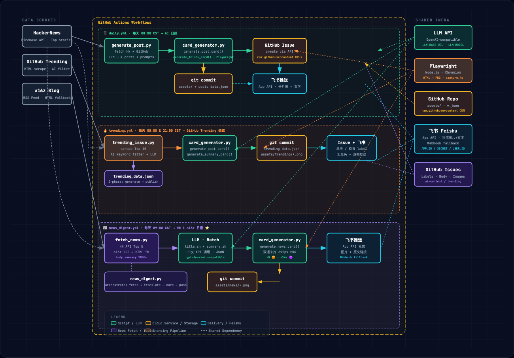

# 📱 AI 日报

> 每天自动抓取 AI 圈热点 + HackerNews + a16z 最新文章，生成小红书风格内容 & 双语简洁卡片，推送至 GitHub Issue 和飞书。

## ✨ 三大功能

### 📱 AI 日报（每天 08:00）
抓取 HackerNews + GitHub Trending AI 项目，用 LLM 生成小红书风格帖子（含封面图），发布为 GitHub Issue 并推送飞书。

### 🔥 GitHub Trending 追踪（每天 08:00 / 21:00）
实时追踪 GitHub Trending AI 项目早晚报，生成小红书卡片推送飞书。

### 📰 HN & a16z 日报（每天 09:00）⭐ 新增
抓取 **HackerNews Top 5** + **a16z 最新 5 篇**文章，LLM 翻译标题 + 生成中文摘要，渲染成双语简洁卡片图片，逐条推送飞书私信。

---

## 📰 HN & a16z 日报卡片预览

每条推送包含一张卡片图片 + 带原文链接的文字消息：

```
┌─────────────────────────────────────────┐
│ 🟠 HACKERNEWS              2026-05-01  │
│ Show HN: We built a local-first tool    │  ← 英文原题
│ 我们做了一个本地优先的协作编辑器          │  ← 中文翻译（彩色）
│ ─────────────────────────────────────── │
│ 摘要                                    │
│ 这个团队花了 18 个月做了一个...           │  ← 80-120字中文摘要
│ ▲ 423 pts  💬 87   ycombinator.com    │
└─────────────────────────────────────────┘

📌 [HackerNews] 我们做了一个本地优先的协作编辑器
▸ Show HN: We built a local-first tool...
🔗 https://...
```

- **HackerNews** — 🟠 橙色主题，显示分数 + 评论数
- **a16z** — 🟣 紫色主题，显示文章域名

---

## 🚀 快速开始（3 步）

### Step 1：Fork 此仓库

点击右上角 **Fork** → 创建你自己的副本

### Step 2：设置 Secrets

进入仓库 **Settings → Secrets and variables → Actions → New repository secret**，添加以下密钥：

| Secret 名称 | 必填 | 适用功能 | 说明 |
|---|---|---|---|
| `LLM_API_KEY` | ✅ | 全部 | OpenAI 兼容 API Key（内容生成 + 翻译）|
| `LLM_BASE_URL` | 可选 | 全部 | API Base URL，默认 `https://api.openai.com/v1` |
| `LLM_MODEL` | 可选 | 全部 | 模型名称，默认 `gpt-4o-mini` |
| `FEISHU_APP_ID` | ✅ 推荐 | 全部飞书 | 飞书 App ID（发私信图片必需）|
| `FEISHU_APP_SECRET` | ✅ 推荐 | 全部飞书 | 飞书 App Secret |
| `FEISHU_USER_ID` | ✅ 推荐 | 全部飞书 | 飞书接收人 User ID |
| `FEISHU_WEBHOOK` | 可选 | 全部飞书 | 飞书自定义机器人 Webhook（降级备用）|

### Step 3：启用 GitHub Actions

进入仓库 **Actions → I understand my workflows, enable them**

完成！三个工作流将按时自动触发。

---

## 🔧 手动触发

```bash
# AI 日报
gh workflow run "📱 AI 日报" --field phase=all

# GitHub Trending 追踪
gh workflow run "🔥 GitHub Trending AI 追踪" --field since=daily --field max_posts=4

# HN & a16z 日报（新）
gh workflow run "📰 HN & a16z 日报" --field hn=5 --field a16z=5
```

---

## 🏗️ 项目结构

```
ai-xiaohongshu-daily/
├── .github/
│   └── workflows/
│       ├── daily.yml           # 📱 AI 日报（每天 08:00）
│       ├── trending.yml        # 🔥 GitHub Trending 追踪（08:00 & 21:00）
│       └── news_digest.yml     # 📰 HN & a16z 日报（每天 09:00）⭐ 新增
├── scripts/
│   ├── generate_post.py        # AI 日报核心脚本
│   ├── trending_issue.py       # GitHub Trending 追踪脚本
│   ├── news_digest.py          # HN & a16z 日报主流程 ⭐ 新增
│   ├── fetch_news.py           # HN + a16z 抓取模块 ⭐ 新增
│   └── card_generator.py       # 共享卡片生成模块（新增 news_card）
├── tools/
│   └── card/
│       └── capture.js          # Playwright HTML → PNG 截图
├── assets/                     # 自动提交的卡片图（按日期归档）
│   └── YYYY-MM-DD/
│       ├── cover1~4.png        # AI 日报封面图
│       ├── trending/           # Trending 卡片
│       └── news/               # HN & a16z 卡片 ⭐ 新增
├── posts_data.json
├── trending_data.json
├── requirements.txt
└── README.md
```

---

## 🏛️ 系统架构

> 三大自动化日报流水线 · GitHub Actions + LLM + Playwright + 飞书推送



| 区域 | 说明 |
|------|------|
| **Data Sources（左）** | HackerNews API、GitHub Trending 爬取、a16z RSS |
| **GitHub Actions Workflows（中）** | 三条独立泳道，按时触发、并行无依赖 |
| **Shared Infra（右）** | LLM API、Playwright 渲染、GitHub Repo 托管、飞书推送、GitHub Issues 归档 |

> 完整交互式架构图见 [`architecture.html`](architecture.html)，本地浏览器打开可缩放查看。

---

## 🔄 工作流程

### 📱 AI 日报（daily.yml）
```
每天 08:00 CST
    ├── 抓取 HackerNews + GitHub Trending AI 项目
    ├── LLM 生成 4 篇小红书风格帖子
    ├── Playwright 渲染封面图 → commit
    ├── 创建 GitHub Issue
    └── 飞书推送（卡片图 + 文字）
```

### 🔥 GitHub Trending（trending.yml）
```
每天 08:00 & 21:00 CST（早报 / 晚报）
    ├── 抓取 GitHub Trending Top 10 → 过滤 AI 关键词
    ├── LLM 生成小红书卡片
    ├── 渲染图片 → commit
    └── 飞书推送
```

### 📰 HN & a16z 日报（news_digest.yml）⭐ 新增
```
每天 09:00 CST
    ├── HackerNews API Top 5（过滤无外链条目）
    ├── a16z RSS Feed Latest 5（备用：HTML抓取）
    ├── 抓取正文摘要（前 1000 字）
    ├── LLM 批量翻译标题 + 生成中文摘要（一次 API 调用）
    ├── Playwright 渲染双语卡片 PNG → commit
    └── 飞书逐条推送（图片卡片 + 原文链接）
```

---

## 🛠️ 本地调试

```bash
git clone https://github.com/your-username/ai-xiaohongshu-daily
cd ai-xiaohongshu-daily
pip install -r requirements.txt
cd tools/card && npm install && npx playwright install chromium && cd ../..

export LLM_API_KEY="***"
export LLM_BASE_URL="https://api.openai.com/v1"
export LLM_MODEL="gpt-4o-mini"
export FEISHU_APP_ID="***" FEISHU_APP_SECRET="***" FEISHU_USER_ID="***"

# AI 日报
python scripts/generate_post.py --phase all

# GitHub Trending
python scripts/trending_issue.py --since daily --max-posts 4

# HN & a16z 日报（预览，不发飞书）
python scripts/news_digest.py --hn 5 --a16z 5 --dry-run

# HN & a16z 日报（完整运行）
python scripts/news_digest.py --hn 5 --a16z 5
```

---

## 📊 API 用量参考

| 功能 | LLM 用量 | 图片生成 | 月度成本估算 |
|---|---|---|---|
| AI 日报（每日） | ~2000 in + 2000 out tokens | 无（Playwright） | ~¥5 |
| GitHub Trending（每日×2） | ~1500 in + 1500 out tokens | 4张/次 | ~¥15 |
| HN & a16z 日报（每日） | ~3000 in + 1000 out tokens | 无（Playwright） | ~¥3 |

**月度总估算：< ¥30**

---

## 📄 License

MIT
